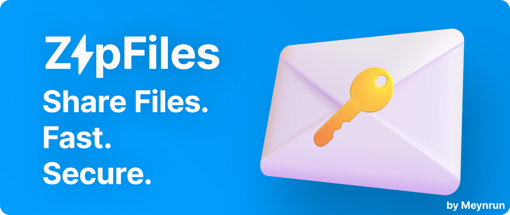

[](./LICENSE)


[](./README.md)
[](./README-ru.md)

[](https://github.com/meynrun/ZapFiles/releases/latest/download/Setup-x64.exe)

### **ZapFiles** - это инструмент для передачи файлов, который обеспечивает конфиденциальность ваших данных благодаря сквозному шифрованию.

# Использование
### Загрузка файла
1. Выберите режим "Скачивание файлов".
2. Введите ключ сервера в поле ввода.
3. Ожидайте, файл будет загружен.

### Отправка фалов
1. Выберите режим "Отправка фалов".
2. Выберите тип IP для передачи файлов:
   - По интернету — для передачи файлов через интернет (требует открытые порты)
   - По локальной сети — для передачи файлов через локальную сеть (например, в одной сети Wi-Fi).
3. Введите имя файла для отправки.
4. Укажите желаемый порт или оставьте его пустым (по умолчанию 8888).
5. Скопируйте ключ сервера и отправьте его получателю для начала передачи.

# Сборка
1. Клонируйте репозиторий: 
```
git clone https://github.com/meynrun/ZapFiles.git
```
2. Установите зависимости: 
```
pip install -r requirements.txt
```
3. Установите [Inno Setup](https://jrsoftware.org/download.php/is.exe)
4. Измените пути в setup_script.iss в соответствии с вашим окружением
5. Запустите build.bat

# ToDo
- [x] Выбор порта
- [x] Прогресс бар
- [ ] Отправка нескольких файлов одновременно

# Возможно в будущем
1. [ ] Встроенный проброс портов
2. [ ] Промежуточные сервера
3. [ ] Конфигурационный файл

## Credits
В логотипе приложения используются значки эмодзи из Windows 11, которые являются собственностью Microsoft.
## Disclaimer
Использование значков emoji из Windows 11 регулируется условиями использования Microsoft. Лицензия MIT распространяется на исходный код приложения, но не предоставляет прав на использование интеллектуальной собственности Microsoft за пределами данного приложения.
